<!-- ===== HERO HEADER ===== -->
<p align="center">
  
</p>

<!-- ===== ARCHITECTURE DIAGRAMS ===== -->
<p align="center">
  
</p>

<p align="center">
  
</p>

<hr/>

<h2 align="center">⚡ Flagship Projects</h2>

<p align="center">
  <sub>Product-style repositories with demos, architecture, and deployable workflows.</sub>
</p>

<table>
  <tr>
    <td width="50%" valign="top">
      <a href="https://github.com/brianhannigan/translator">
        
      </a>
      <h3>🧠 Portable Translator (Offline AI)</h3>
      <p>Self-contained OCR + offline translation engine built for field use and disconnected environments.</p>
      <ul>
        <li>WPF UI + embedded Python orchestration</li>
        <li>Tesseract OCR + Argos / Marian NMT</li>
        <li>Local APIs, health checks, PID management, audit logging</li>
      </ul>
      <p><a href="https://github.com/brianhannigan/translator"><strong>View repository →</strong></a></p>
    </td>
    <td width="50%" valign="top">
      <a href="https://github.com/brianhannigan/SurgicalVisualization">
        
      </a>
      <h3>🧬 SurgicalVisualization (3D Medical)</h3>
      <p>3D model inspection platform for surgical / medical STL/OBJ workflows with desktop + web engines.</p>
      <ul>
        <li>WPF + HelixToolkit for desktop rendering</li>
        <li>Three.js browser engine for web-based inspection</li>
        <li>Mesh inspection, camera controls, visualization tools</li>
      </ul>
      <p><a href="https://github.com/brianhannigan/SurgicalVisualization"><strong>View repository →</strong></a></p>
    </td>
  </tr>
  <tr>
    <td width="50%" valign="top">
      <a href="https://github.com/brianhannigan/kql-threathunting-beginner-guide">
        
      </a>
      <h3>🛡 Threat Hunting (KQL / SIEM)</h3>
      <p>Practical threat-hunting playbooks and detection engineering workflows for SOC-style investigations.</p>
      <ul>
        <li>KQL investigations &amp; correlations</li>
        <li>Attack chain reasoning &amp; hypotheses</li>
        <li>Documentation-first, repeatable hunts</li>
      </ul>
      <p><a href="https://github.com/brianhannigan/kql-threathunting-beginner-guide"><strong>View repository →</strong></a></p>
    </td>
    <td width="50%" valign="top">
      <a href="https://github.com/brianhannigan/soc-investigation-azuki-import-export">
        
      </a>
      <h3>🍵 SOC Investigation Azuki (Import/Export)</h3>
      <p>Hands-on SOC investigation workflows for importing and exporting case data with practical triage and analysis patterns.</p>
      <ul>
        <li>SOC case import/export investigation workflow</li>
        <li>Analyst-oriented triage and data handling patterns</li>
        <li>Documentation-first approach for repeatable operations</li>
      </ul>
      <p><a href="https://github.com/brianhannigan/soc-investigation-azuki-import-export"><strong>View repository →</strong></a></p>
    </td>
  </tr>
</table>

<hr/>


---
## 🔥 Mission

I build **secure, intelligent, mission-critical systems** designed to operate in real-world environments.

From **DoD simulation platforms** to **offline AI translation engines**, my work blends:

- 🛡 Cybersecurity & Compliance  
- 🧠 AI / LLM Systems  
- 🖥 Desktop & 3D Visualization Applications  
- ⚙️ Infrastructure Automation  
- 🔐 Zero-Trust Architectures  

---

# 🧭 Portfolio Navigation

## 🛡️ IT & Cybersecurity

I'm passionate about cybersecurity and enjoy solving complex, real-world security challenges through hands-on projects.  
My work spans vulnerability management, threat detection, and security operations—focused on practical impact, not theory.

## 🧠 AI & Intelligent Systems

### 🔹 Portable Translator (Offline AI Translation Engine)
> Self-contained OCR + AI translation platform with embedded Python and local model hosting.

**Highlights**
- Argos + Marian NMT support  
- Embedded Tesseract OCR  
- Offline model hosting  
- Local API services  
- WPF + Python hybrid architecture  
- Secure background service orchestration

**[Language Translator](https://github.com/brianhannigan/translator)**

 

---
### 🔹 SurgicalVisualization (3D Medical Engine)
> HelixToolkit + Three.js 3D model inspection and surgical analysis platform.

**Highlights**
- STL / OBJ 3D rendering  
- Desktop (WPF) + Web (Three.js) dual engine  
- Camera control + mesh inspection  
- Precision zoom + lighting control  
- Clean dark-mode surgical UI  

**[Medical 3D Simulator (SurgicalVisualization)](https://github.com/brianhannigan/SurgicalVisualization)**


***3D medical visualization and simulation project focused on surgical anatomy exploration and training.***


  ---

## 🛡 Cybersecurity & Intelligence Engineering

### 🔹 Threat Hunting & Detection Engineering
- KQL investigations  
- Log correlation  
- SIEM analytics  
- Incident triage workflows  
- Detection engineering  
- SOC data import/export analysis workflows

🔗 Example Repository:  
https://github.com/brianhannigan/kql-threathunting-beginner-guide

🔗 SOC Investigation Import/Export Repository:  
https://github.com/brianhannigan/soc-investigation-azuki-import-export


---

### 🔹 Vulnerability & Compliance Engineering
- Nessus scanning  
- DISA STIG remediation  
- Patch validation  
- Secure configuration baselines  
- Risk tracking & documentation  

---

## 🧱 Infrastructure & Systems Engineering

- Docker-based service orchestration  
- QEMU + Ubuntu VM automation  
- Offline deployment packaging  
- Embedded Python distribution  
- Windows service wrappers  
- Local API hosting  
- Structured logging systems  

---

# 🏗 Architecture Philosophy

I design systems using layered separation of concerns:

```
User Interface Layer
        ↓
Application Logic Layer
        ↓
Service Orchestration Layer
        ↓
Isolated Engine Layer
        ↓
Secure Local or Remote Models
```

### Core Principles

✔ Offline-first when possible  
✔ Zero-trust boundaries  
✔ Clear separation of concerns  
✔ Reproducible deployment  
✔ Deterministic startup & logging  
✔ Secure configuration management  

---

# 🎬 Product-Style Engineering

Each major repository is structured like a **product launch**, not just a code dump.

Includes:

- Animated SVG workflows  
- UI state transitions  
- Before/after visual demos  
- Architecture diagrams  
- Installation walkthroughs  
- Clean documentation hierarchy  

My goal is not just to build software —  
but to build **deployable systems with clarity and confidence.**

---

# 📊 Technical Stack

## Languages
- C#  
- Python  
- JavaScript / TypeScript  
- PowerShell  
- SQL  

## Frameworks & Platforms
- .NET / WPF  
- HelixToolkit  
- Three.js  
- Docker  
- Argos Translate  
- Marian NMT  
- Tesseract OCR  
- QEMU  
- GitHub Actions  

---

# 🧩 Current Focus Areas

- Advanced AI model orchestration  
- Self-contained deployable systems  
- Offline enterprise AI tooling  
- Intelligent threat analysis  
- 3D visualization engines  
- Zero-trust application design  
- Hybrid desktop + web architectures  

---

# 🏛 Professional Background

- 14+ years supporting Government projects  
- Mission-critical system development  
- Secure enterprise deployments  
- Cybersecurity engineering  
- Technical architecture & leadership  
- AI-powered application design  

---

# 🤝 Connect

LinkedIn: https://linkedin.com/in/brianjhannigan  
GitHub: https://github.com/brianhannigan  

---

# 📌 What This Profile Represents

This is not a collection of school projects.

This is a working laboratory of:

- Deployable AI systems  
- Production-grade architectures  
- Secure engineering practices  
- Real-world infrastructure tooling  
- Advanced visualization engines  

I build systems that are:

**Secure. Intelligent. Deployable.**
---


## 🔐 SOC / MSS Security Work (Highlights)
I focus on practical, operations-ready security work: alert triage, vulnerability scanning, secure configuration, and clear client-facing reporting.

---

## ⚠️ Vulnerability Management Projects -- UPDATING

- 🔍 **[Vulnerability Management Program Implementation]**  
  End-to-end vulnerability management workflow covering discovery, prioritization, remediation, and reporting.

- 🛠️ **[Programmatic Vulnerability Remediations (PowerShell & Bash)]**  
  Automated remediation scripts for common security findings across Windows and Linux environments.

---

## 🚨 Threat Hunting & Security Operations -- UPDATING

- 🐾🔐 **[Threat Hunting Scenario - CloutHaus](https://github.com/brianhannigan/KC7-CloutHaus)**  
   Phishing → Mailbox Compromise → Exfiltration (KQL Case Study)
  
- 🕵️ **[Threat Hunting Scenario – TOR Browser Usage]**  
  Detection and investigation of anonymization tools within enterprise environments using realistic SOC workflows.

- 🤖 **[Automated Incident Tracking](https://github.com/brianhannigan/automated-incident-tracking)**  
  Streamlined incident intake and tracking to support SOC reporting and response workflows.

- 🕵️ **[SOC Agent Lab](https://github.com/brianhannigan/soc-agent-lab)**  
  Autonomous AI agents for SOC alert triage, detection engineering, and log intelligence.

- 📊 **[SIEM Engineering Lab](https://github.com/brianhannigan/siem-engineering-lab#readme)**  
  Detection engineering and log-analysis workflows for practical SOC operations.

- 🛰️ **[Secure Infrastructure Observability Lab](https://github.com/brianhannigan/secure-infrastructure-observability#readme)**  
  Security-focused observability pipelines for resilient and monitorable infrastructure.

- ✅ **[Compliance Automation Toolkit Lab](https://github.com/brianhannigan/compliance-automation-toolkit#readme)**  
  Automation-driven compliance checks and reporting to reduce manual security overhead.

  

---
##  Artificial Intelligence \ Machine Learning -- UPDATING

- **[Lightweight Finetuning Foundation Models](https://github.com/brianhannigan/LightweightFinetuningFoundationalModel)** 

  Apply parameter-efficient fine-tuning (PEFT) to adapt a pretrained Hugging Face model for a text classification task, then compare baseline and fine-tuned performance. 

## 🛡️ Software Development
C#


- ** Screen Sender
- **
  
Python
- ** XML Parser
- ** [UpWork Auto-Scraper & AI Proposal Generator](https://github.com/brianhannigan/brianhannigan/blob/master/Readme-UpWorkScraper)**
  
Powershell
- ** Project Creator
- 
Full Stack React

---
### Core Skills
- SOC Operations: alert triage, incident documentation, escalation workflows
- Vulnerability Management: Nessus scanning, findings documentation, remediation tracking
- Compliance & Hardening: DISA STIG-aligned secure configuration (Windows/Linux fundamentals)
- Security Awareness: phishing/social engineering readiness, training & reporting
- Tooling: Git, VMware, Docker, scripting (Python/PowerShell/Bash)

### What I Deliver
- Clean documentation (SOPs/runbooks) that makes security repeatable
- Signal-over-noise mindset for tuning and validating alerts
- Customer-ready status updates and summaries that drive action

## 🤝 Connect With Me

- 💼 **LinkedIn:** https://www.linkedin.com/in/brianhannigan/
- 🧠 **GitHub:** https://github.com/brianhannigan

---

> 🔒 *Focused on building secure, resilient systems and training the next generation of engineers and defenders.*


Focused Areas:
• SIEM Engineering & Log Analysis
• Infrastructure Observability
• Secure Configuration (STIG/Nessus)
• Security Automation (Python/Bash)
• Threat Detection Workflows
